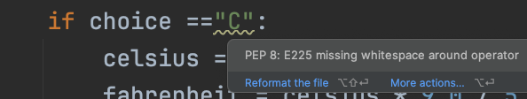
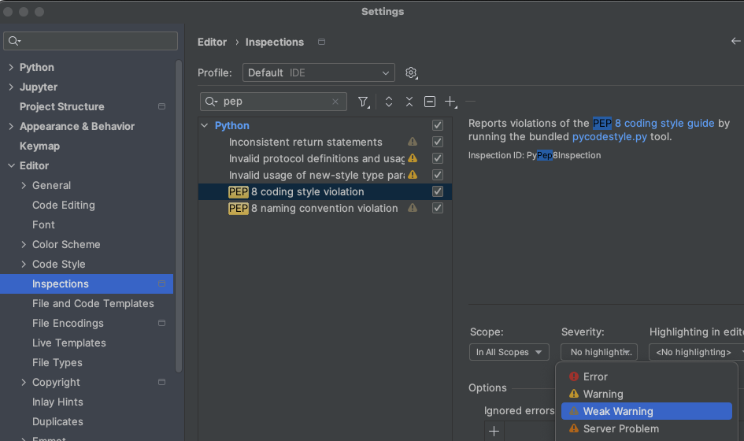
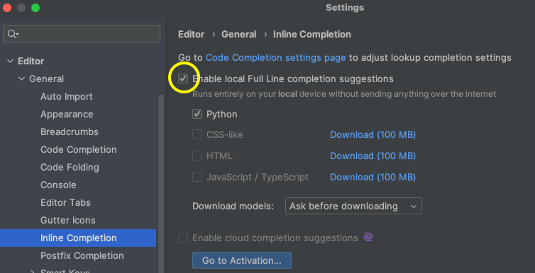
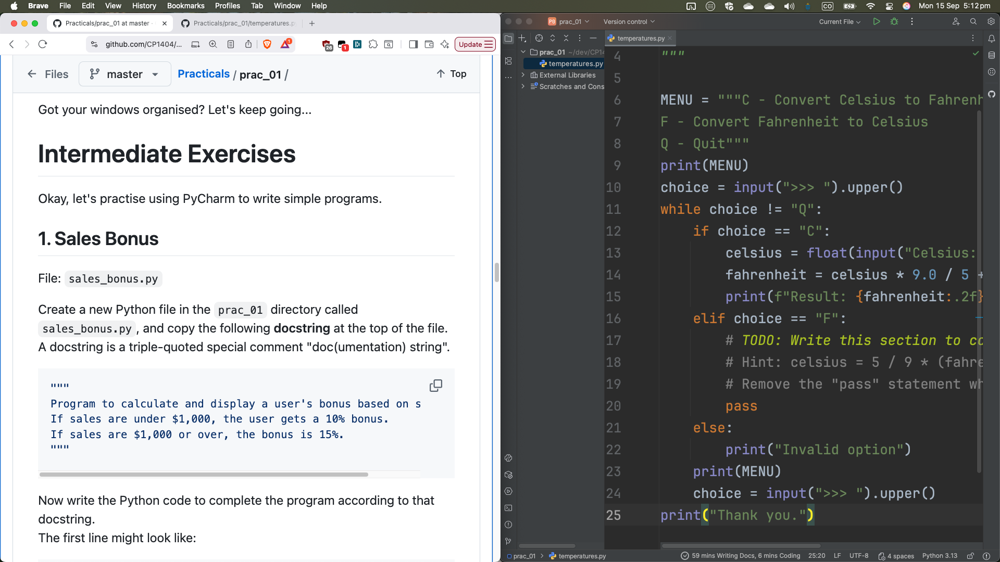
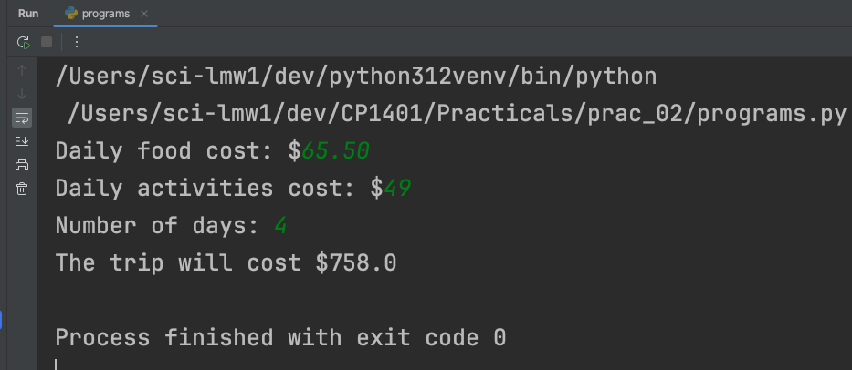

# Practical 02 - Input, Processing and Output

## Read and Understand

Make sure you read the instructions carefully.  
Do not make the easy bits hard by not reading the instructions.  
We want the challenge to be in the new things you're learning and trying, not in the reading and paying attention to
what the questions ask.  
Don't waste time by trying to save time skim-reading. Just read... and understand... then do.

As you do individual work on your computer, if you need help, start by talking to your peers.  
External JCUA students are encouraged to use Slack to ask questions of others in the class.

Let's use PyCharm as our text editor:

- Run PyCharm
- Open your existing Practicals project (made last prac), or if you don't have it with you for some reason, create a new
  one following the instructions in the last prac.
- Create a new folder (directory) with the exact name `prac_02`. Do not make a new project for each prac,
  only new folders.
- Now create a new text file: Choose **File > New... > File**  (not Python file)
- Name your file `p2questions.txt` (the `.txt` extension means PyCharm won't try and correct your Python code... it's just
  text). Also, the `.txt` extension means that LearnJCU will show it to your markers correctly.
- Make sure your new file is inside the `prac_02` folder. If it isn't, just drag it inside.

## Quick Questions

Add the heading "Quick Questions" to `p2questions.txt`. Leave a blank line, then answer these questions with numbering.

1. Write two variable names that would be **valid** and well-named.
2. Write two variable names that would be **valid** but not well-named.
3. Write two variable names that would **not be valid**.
4. What is the naming convention for variables in Python?
5. What is a constant? Give an example of when you would use one.
6. What is the naming convention for constants?

## Logic Exercise

A drawer contains 10 black and 10 white socks that are all mixed up. What is the fewest number of socks you can take
from the drawer _without looking_
and be **sure** to get a pair of the same colour?

When you've decided on an answer for this, discuss it with a group near you.  
If you have a different answer, try and figure out why/how you arrived at different answers.  
Is there a meaningful way that you can explain your answer, perhaps a diagram that would help?

Add the heading "Logic Exercise" to `p2questions.txt`. Leave a blank line, then write your answer for the question.  
See how this works? :)

# Python Coding - Input, Processing and Output

Before we do much programming, we need to configure PyCharm.

- If you see an underline, move your mouse over it (**but don't click!**) to see what the
  issue is, and look at the action PyCharm suggests to fix it for you. Example:  
  

If you don't see underlines for formatting warnings, change the following setting:  
**File (or PyCharm on Mac) > Settings > Editor > Inspections**  
Search for "PEP" and select "PEP 8 Coding Style Violation" then change the severity to "Weak Warning" as in this
screenshot:



> [!WARNING]
> We love being productive, and we don't want you to waste time, BUT...  
> We're not just trying to get through this work as quickly as possible. What we really want is to learn.  
> With this in mind, we are purposely choosing NOT to use AI in this subject at all.  
> So, turn off PyCharm's very handy AI full line completion now.

Open the settings:  
File (or PyCharm on Mac) > Settings > Editor > General > Inline Completion  
**Untick** "Enable local Full Line completion suggestions"



**Here's a quick story to help illustrate the point.**

Lindsay was working with a student in a prac recently whose code had some problems.  
He asked the student why they had chosen to implement the code that way, and the student replied:  
*"Not gonna lie, I just pressed Tab multiple times."*

* If you want to finish the job quickly, get AI to do it... but you will not learn much.  
* If you want to learn and build your own skills, don't use AI... but choose to learn all you can.

While we're thinking about being more productive...  
A good way to organise your workspace is to put these instructions on
one side of your screen, and your code (PyCharm) on the other side.
Windows users can use the Windows key + arrow shortcuts for this.  
Now you don't have to waste time switching back and forth between these two windows!  
Drag the bar between your project files and your code so that you
can see lots of code (or hide the project window altogether with Alt+1).



Got PyCharm configured and your windows organised? Let's keep going...

## Example

Let's walk through a complete example, from problem description, through problem solving to code and testing.  
Just read along and understand. Do not "do" any of this, just read it and make sure you understand.

### Problem Description:

Leia and her friend Han are enjoying a nice meal at a restaurant when they realise it's a public holiday and there's a
surcharge. She wants to find out what the cost of the meal will be including the surcharge.  
Leia wants to write a program on her laptop to figure this out but complains that her hands are dirty. Han says, "My
hands are dirty too; what are you afraid of?"

When you break it down and remove the irrelevant parts, you can see this is a simple problem that follows the basic
pattern:

- Input
- Processing
- Output

### Algorithm

```
get original_price and surcharge_rate
extra_charge = original_price * surcharge_rate
total_price = original_price + extra_charge
display total_price  
```

We could have done the processing calculation either in one step or two.  
Using more steps with good variable names is usually more readable and extensible, but either way is mostly OK.

Also note that here we have used terms written like `original_price`, valid variable names.  
It's fine if you want to use `original price` or something similar, but doing it like variables means that you can
copy-and-paste your pseudocode and then convert it to Python without rewriting your terms.

Note also that we used the term, `surcharge_rate` and not just `surcharge`.  
We could have used something like `surcharge_percentage`, but if we had used just `surcharge`, we might find it hard to
remember if it means surcharge like 15% (0.15) or like $15 (amount).  
**Variable names should be unambiguous.**

### Code

```python
original_price = float(input("Original price: $"))
surcharge_rate = float(input("Surcharge % (e.g. 0.15 is 15%): "))
extra_charge = original_price * surcharge_rate
total_price = original_price + extra_charge
print("The total meal price is $", total_price, sep="")
```

### Testing

Just because the code is written, doesn't mean it works, so we need to test it. How?  
Put in some meaningful/easy inputs so that you can evaluate if the output matches what you expect.  
E.g., We can easily calculate that 15% of 100 is 15, so a $100 meal with a 0.15 (15%) surcharge should cost $115.

```
Original price: $100
Surcharge % (e.g. 0.15 is 15%): 0.15
The total meal price is $115.0
```

Looks good.

Create a new Python file, `p2example.py` (File > New > Python File)    
**Now, you type this code in (don't copy it)**, and **test it** with some other values.  
The reason you want to _type_ instead of _copy_ this code is because it helps you learn to use the IDE (e.g., use
autocomplete!), type code accurately, and develop an eye for detail.

# Coding Exercises

Write all of your answers to the following questions in a single Python file called `p2programs.py`.

At the top of each program, put a **comment** with the exercise number/name (copy-and-paste it from
here) so we all know what the program is.  
If a question does not require pseudocode, you can use a simple block comment like:

```python
# 4. Deep Sleep Calculation
...
``` 

The easiest way to write pseudocode for a question is in a multi-line comment like:

```python
"""
2. Kilometres to Miles

get distance_in_kilometres
...
"""
distance_in_kilometres = float(input("Distance in kilometres: "))
...
``` 

## 1. Discount Price

**Write a complete Python program** that calculates the discounted price of an item given an original price and a fixed
discount of 20%.  
Here is the algorithm already done for you in pseudocode:

```
get original_price
discount = original_price * 0.2
new_price = original_price – discount
print new_price
```

**Test** this using meaningful test data that you can understand.

Once you have done this, adjust your program so that `0.2` is a **named constant** instead of a **magic number**.  
Test it again.  
Always test your programs after you modify them. You might have broken something.

We just added another name (the named constant), so check your existing names and see if you need to improve anything.  
Remember to follow our teaching
and [style guide for good naming](https://github.com/CP1404/Starter/wiki/Style-Guide#identifier-naming).

Now that you've started thinking about **constants**, you should consider using them appropriately. We won't always tell
you when/if to use a constant,
but [you should understand how and when to use constants](https://github.com/CP1404/Starter/wiki/Programming-Patterns#constants)
.  
Use at least one more appropriate constant in your solutions for this practical!

### Commenting Out Code

Now that you want to move on to the next exercise, you _could_ start a new file, but instead please just keep using the
same one.  
However, you don't want to _run_ the old programs as well as the new one, so you can "comment out" the previous program
code.  
To do this, select the lines of code (doesn't need to be exact characters, just any part of the right lines) and
press `Ctrl+/` (Windows) or `Cmd+/` (Mac).

> [!NOTE]
> BEFORE you finalise and submit your practical, you must "uncomment" your finished code.

## 2. Kilometres to Miles

Joseph has recently moved to Australia from the United States. He understands that distances are given in kilometres
rather than the miles he is used to.  
**Write pseudocode** for a program that will request a distance in kilometres and output the same distance in miles.  
**Then, implement this algorithm in Python code.**

- 1 mile = 1.60934 kilometres
- 1 kilometre = 0.621371 miles

A conversion rate is a good situation to use a constant.  
Choose a name that clearly indicates what's being converted to what.

## 3. Holiday Cost

Sonje has been invited on a holiday by her friends, but she is not sure how much it will cost in total.  
She knows the cost of the hotel will be $75 per day. (Let's keep it simple and assume days and nights are the same
thing.)   
She would like to be able to enter estimates for daily food cost and daily activity cost and then work out the total
based on the number of days for the trip.  
For simplicity, assume that each day's costs are the same.  
Help Sonje by **writing a program** that will figure out the total cost for the holiday.  
**Write pseudocode** for this first.

> [!NOTE]
> Below is some sample output showing user entry.  
> Whenever we provide sample output, it is a requirement that your solution matches it.  
> Please note that this is what the entire program looks like when it's finished.  
> We copied the contents of the Run window, including prompts, user input, other outputs.  
> In this example, the user entered `65.50` for the daily food cost, `49` for the activities and `4` for the number of
> days. These numbers in the output are not printed by your code, but are the user's inputs.  
> We will never ask you to closely match the output and then not show you what the program results look like!

```
Daily food cost: $65.50
Daily activities cost: $49
Number of days: 4

The trip will cost $758.0
```



## 4. Deep Sleep Calculation (Percentage)

Derek wants to track his quality of sleep and understand what percentage of his night's sleep is "deep".  
Deep sleep is when your body and brain waves slow down and is important for proper restoration. Derek has an app that
tracks his sleep but only shows him total time asleep and total time in "deep sleep". He wants to know the percentage of
deep sleep.

### Version 1 - simple percentage

Here's an example of what the simple program will look like:

```
Total sleep in seconds: 161
Deep sleep in seconds : 62

Percentage = 0.3850931677018634
```

Can you see how this will work? Looks like our I, P, O pattern...

- Write a program that asks for the **total sleep** and the **deep sleep** in seconds, then displays the percentage.
- Use the same example above to test, so 62 seconds deep, 161 seconds total (short sleep!) should give 0.38509...  (
  don't
  worry about formatting the output neatly yet).

### Version 2 - minutes and seconds

**ONLY** when you have version 1 working, should you then focus on enhancing the program.  
_You do not need to submit two versions, just update your version 1 code._  
Keep the inputs the same, but write the output so that it appears as:

```
Total sleep in seconds: 161
Deep sleep in seconds : 62

Deep sleep  = 1m 2s
Total sleep = 2m 41s
Percentage  = 38.50931677018634%
```

How do we handle minutes and seconds like in this example?  
Remember how the **modulo** operation works, and is useful for repeating cycles like time in minutes and seconds?  
We know:  
`161 seconds is 2 minutes and 41 seconds`  
Because:    
`161 // 60 = 2`  
`161 % 60 = 41`

Also, 0.385 isn't the percentage we want. We want something more like 38.5%. So, what do we need to do to get from 0.385
to 38.5?  
(Don't worry about the number of decimal places at this stage; we'll learn about handling that later using string
formatting.)

Knowing this, complete your program so that it outputs like we want. As always, use good variable names.

> [!IMPORTANT]
> **Before you finish** with this file, "uncomment" your previous code for all programs.    
> Leave the actual comments for headings and pseudocode, but return the rest of the code back to normal.    
> To do this, select the lines of code and press `Ctrl+/` for each program.
> Don't waste your time commenting or uncommenting large blocks of code manually by typing or deleting `#` one at a
> time. Ain't nobody got time for that :)

## Reflection

In `p2questions.txt`, type the heading "Reflection" and answer the following questions:

1. What is your current **career goal**? What work do you see yourself doing 5 years from now?
2. How are your current efforts in this subject helping you achieve that goal?
3. What can you do differently to improve the value of your time at university as you work towards your goals?

# Practice and Extension

These final sections in practicals are not _required_ to be completed for marks, but you will definitely find benefit in
completing them for extra practice and to extend yourself.  
The more practice you do, the more you develop and "lock in" your new skills.

Create a new file, `practice.py` to complete these tasks in. You do not need to submit this.

## BMI

Implement the following algorithm for calculating BMI (body mass index):

```
get height 
get weight
bmi = weight / (height ** 2)
display bmi
```

## Maths Operators

There is a list of common mathematical operators in your notes.   
Write a program that asks the user for two floats called `lhs` and `rhs`, then prints the outputs for the expressions
that use those numbers and a maths operator.  
Note that we are OK with a variable name like `lhs` here because:

- it's a very [common abbreviation for "left hand side"](https://en.wikipedia.org/wiki/Sides_of_an_equation)
- it is unambiguous in this context
- there is no better, more obvious name (e.g. it doesn't mean `age` or `score` or anything else)

Example, if the user enters 2.5 and 3, it would print:

```
2.5 + 3.0 is 5.5
2.5 * 3.0 is 7.5
2.5 // 3.0 is 0.0
...
```

Use as many operators as you can - not just these ones.

## Number Conversions

Write as many programs as you can handle that convert values in one unit of measurement to another, such as (and the
reverse):

- kilograms to pounds
- fahrenheit to celsius
- feet and inches to metres and centimetres
- currencies...

# Extension

If you're cruising and want more of a challenge, look
up [how to do string formatting](https://docs.python.org/3/library/stdtypes.html#str.format) so that you can produce
neatly lined up output with a fixed number of decimal positions for the above programs, especially the deep sleep one.

# Deliverables

This section summarises the expectations for this practical.  
Please follow the [submission guidelines](../README.md#submission) to ensure you receive marks for your work.

**Files required:**

`p2questions.txt` with:

- Quick Questions
- Logic Exercise
- Reflection

`p2programs.py` with:

- Discount Price
- Kilometres to Miles (with pseudocode)
- Holiday Cost (with pseudocode)
- Deep Sleep Calculation
