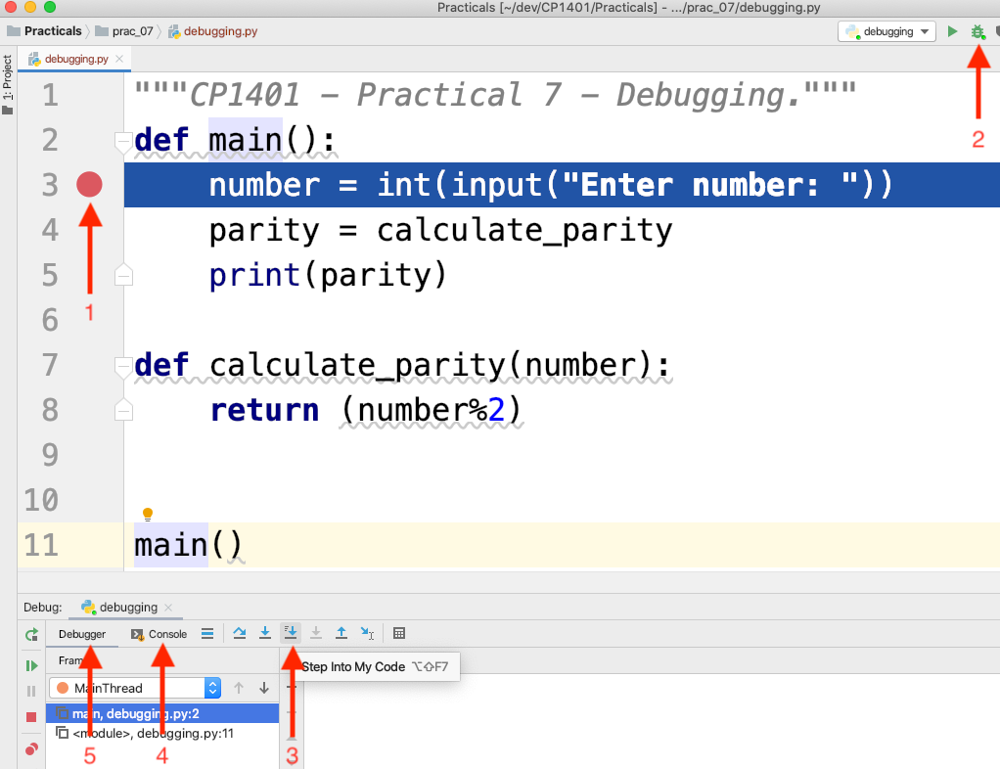

# Practical 07 - Functions 2 

**All students (internal and external), please submit your prac work via LearnJCU each week by the due date.**  

Write your answers for the early non-coding questions in a simple text file called `questions.txt`.  

This practical builds on the Functions 1 and 2 lectures as well as practical 6.  
If you haven't learned from those, then go back and do so before continuing with this practical work.

## Quick Questions

1. Where should global constants be placed in a program?
2. What are two reasons why you should not use global variables?
3. When you have two variables with the same name but in different functions, these said to have different ____?
4. What do you call the red dot in the margin in PyCharm that pauses the program running when using the debugger?  
5. Briefly explain what would be wrong if you had a line of code like `SOME_VALUE += 1` (assume that `SOME_VALUE` is actually a meaningful name).
6. What is the single most important design principle for designing functions?

## Logic Exercise

Read the following out loud:

    NORTH QUEENSLAND
    IN THE
    THE SPRING

Good job. Or was it? Double-check that you said it correctly.  
If you didn't... notice that you had trouble with attention to detail.  
This is a fairly normal issue, but one that programmers need to deal with more so than 'regular' people.  
You need to continue to systematically build your attension to detail ;) 


# Debugging
Debugging is the process of finding and fixing problems in code (yours or someone else's), and is an important skill to develop.  
Like our fun logic exercises, it's not just about quickly finding the answer, but about learning to systematically figure it out.  
It's great if you spot/fix an issue straight away, but what if you know there's a problem but can't see it immediately?  
You need to develop attention to detail as well as be able to use debugging tools to help you.

In the "Functions 2" lecture, we introduced the PyCharm debugger.  
(Again, if you haven't watched that lecture, *please* stop now and go back to the lecture!)
  
Let's use the debugger now to try and systematically figure out what's wrong with the following programs.  
In all cases, read the code and try and understand it, then 
practise using the debugger as instructed to "step through" the program.

Note: PyCharm does wonderful "on the fly" debugging by highlighting problems or potential issues in your code.  
Get used to spotting the red/green/grey underlines and other warnings and potentially correcting the issues PyCharm tells you about.   

Right-click on your `prac_07` folder (that's what you called it, right?) 
and create a new Python file here called `debugging.py`
Copy the **raw** version of the code found at the link below and paste
into your file...  
Click on the link below, then click the Raw button to get a version
suitable for copying.  
  
Don't just copy from the normal view, without clicking Raw, or you
will *not* get proper formatting. OK?  

- [debugging.py](./debugging.py)

Follow the arrows in this screenshot to:
1. Create a breakpoint on the first line that should run (click in the margin to create breakpoints).
2. Run the debugger (if this is the first time you've run this program, which it will be, right-click your code and choose "Debug debugging").
3. The program will run until it reaches the breakpoint. Click the "Step into my code" button to run line by line (click it once per line).
4. The debugger will stop responding when user input is being asked for, so click (4) to switch to the Console and enter your input.
5. The debugger will continue to the next line, so switch back (5) to the Debugger window to see the state of your variables.

Keep clicking through "Step into my code" to see exactly how the program runs and what the values of variables are.  
You will need to switch between the "Console" (to see output and enter input) and "Debugger" (to see program state) windows.



There are four "main" programs in "debugging.py" for you to debug separately (use a new breakpoint at the start of each).  
Test/debug each, one at a time.  
When you've finished one, "comment out" its main call and "uncomment" the next one.  
Example, when testing main_3, the bottom of your code would look like:
```python
# main()
# main_2()
main_3()
# main_4()
``` 

For each program write what you found to be the problem... and solution if you can figure it out.  
Note that *"problem"* and *"solution"* are different things.  
Example, if restarting your PC makes it run faster, that's just a (temporary) solution, not what problem was causing it to run slowly.

Write your answers at the bottom of `questions.txt` in a section like below:
```
Debugging:

1. 
2. 
3. 
4. 
```


# Python Coding - Functions 2 - Coding Exercises
 
## 1. Jerry the Driver
File: `jerry.py`  

In the Functions 2 lecture, you had a "Do this now" question:

> Jerry's car's speedo shows miles (mph) instead of kilometres per hour (kph). He wants to be able to enter his speed in mph, the speed limit in kph and determine if he will get any speeding fine. 

You (we) wrote the pseudocode for the main function for this:

```
function main
    speed_in_m = get_valid_number("speed in m")
    speed_in_km = convert_m_to_km(speed_in_m)
    speed_limit_in_km = get_valid_number("speed limit in km")
    fine = determine_fine(speed_in_km, speed_limit_in_km)
    print fine
```

**Write the complete Python program** for this in `jerry.py`.

Remember that you've done some of this before, so copy your previous work:  

- [Prac 2 where we calculated km -> m](../prac_02/README.md#2-miles-to-kilometres) 
- [Prac 3 where we determined speeding fines](../prac_02/README.md#6-speeding-fines)

**Test** this using meaningful test data that you can understand.  


## 2. Dog Years
File: `dog_years.py`  

In [Prac 3](../prac_03/README.md#4-dog-years) you wrote a program to calculate a dog's age in dog years.  
Rewrite this program using a function for the conversion.  
Write a main function that repeatedly asks the user for an age in human years until the user enters a negative number.  

Here's the calculation part already:  
```python
if human_years <= 2:
    dog_years = human_years * 10.5
else:
    dog_years = 21 + 4 * (human_years - 2)
```

## 3. Seconds Display
File: `seconds.py`  

In [Prac 2](../prac_02/README.md#4-i-stop-calculation-percentage) you wrote a program to calculate and display i-stop time/percentage.  
In that, you displayed seconds as minutes and seconds, example: 
```
i-stop on in seconds: 62
Time stopped in seconds: 161

i-stop ON:      1m 2s
Time Stopped:   2m 41s
Percentage:     38.50931677018634%
```

Rewrite this program using a function that **takes in a number** of seconds and **returns a string** to display that value in minutes and seconds.  
Write a main program that simply displays a bunch of different seconds values in minutes and seconds using a loop.  
Example output: 
```
0 seconds is 0m 0s
635 seconds is 10m 35s
1270 seconds is 21m 10s
1905 seconds is 31m 45s
2540 seconds is 42m 20s
3175 seconds is 52m 55s
```

Note: the original program from prac 2 was about i-stop values, but this has nothing to do with that.  
The technique for figuring out minutes and seconds from just seconds is the same, so you can copy your work, 
but do change any references to the old context. 

## 4. BMIs
File: `bmis.py`  

In [Prac 6](../prac_06/README.md#example) we wrote a program to calculate a person's BMI and weight category using functions.  

Copy those functions (not main) and write a new main program with a loop that runs through a number of weights for a 1.75m person, as below.

Note: You can limit precision of a float using something like:
```python
value = 3.1415926535
print(f"{value:.1f}")  # prints 3.1
```
The `:` separates the variable name (value) from the "format specifier".  
In this case, `.1f` means to produce only 1 decimal place for our **f**loat.  

Another common format specifier is just a number, like:
```python
value = 17
print(f"!{value:4}!")  # prints !  17! (that is, 17 takes up 4 spaces)
```

OK, let's do this:
```
Height 1.75m, Weight 50kg = BMI 16.3, considered underweight
Height 1.75m, Weight 52kg = BMI 17.0, considered underweight
Height 1.75m, Weight 54kg = BMI 17.6, considered underweight
Height 1.75m, Weight 56kg = BMI 18.3, considered underweight
Height 1.75m, Weight 58kg = BMI 18.9, considered normal
Height 1.75m, Weight 60kg = BMI 19.6, considered normal
Height 1.75m, Weight 62kg = BMI 20.2, considered normal
Height 1.75m, Weight 64kg = BMI 20.9, considered normal
Height 1.75m, Weight 66kg = BMI 21.6, considered normal
Height 1.75m, Weight 68kg = BMI 22.2, considered normal
Height 1.75m, Weight 70kg = BMI 22.9, considered normal
Height 1.75m, Weight 72kg = BMI 23.5, considered normal
Height 1.75m, Weight 74kg = BMI 24.2, considered normal
Height 1.75m, Weight 76kg = BMI 24.8, considered normal
Height 1.75m, Weight 78kg = BMI 25.5, considered overweight
Height 1.75m, Weight 80kg = BMI 26.1, considered overweight
Height 1.75m, Weight 82kg = BMI 26.8, considered overweight
Height 1.75m, Weight 84kg = BMI 27.4, considered overweight
Height 1.75m, Weight 86kg = BMI 28.1, considered overweight
Height 1.75m, Weight 88kg = BMI 28.7, considered overweight
Height 1.75m, Weight 90kg = BMI 29.4, considered overweight
Height 1.75m, Weight 92kg = BMI 30.0, considered obese
Height 1.75m, Weight 94kg = BMI 30.7, considered obese
Height 1.75m, Weight 96kg = BMI 31.3, considered obese
Height 1.75m, Weight 98kg = BMI 32.0, considered obese
Height 1.75m, Weight 100kg = BMI 32.7, considered obese
```

Got it? Good. Now, let's try it with varying heights as well as weights, like:  

Hint: 1.5m is 150cm; useful to know since `range` only works with integers.  
Notice also that the values line up nicely. You don't have to do this, but see if you can. 
```
Height 1.5m, Weight  50kg = BMI 22.2, considered normal
Height 1.5m, Weight  60kg = BMI 26.7, considered overweight
Height 1.5m, Weight  70kg = BMI 31.1, considered obese
Height 1.5m, Weight  80kg = BMI 35.6, considered obese
Height 1.5m, Weight  90kg = BMI 40.0, considered obese
Height 1.5m, Weight 100kg = BMI 44.4, considered obese
Height 1.6m, Weight  50kg = BMI 19.5, considered normal
Height 1.6m, Weight  60kg = BMI 23.4, considered normal
Height 1.6m, Weight  70kg = BMI 27.3, considered overweight
Height 1.6m, Weight  80kg = BMI 31.2, considered obese
Height 1.6m, Weight  90kg = BMI 35.2, considered obese
Height 1.6m, Weight 100kg = BMI 39.1, considered obese
Height 1.7m, Weight  50kg = BMI 17.3, considered underweight
Height 1.7m, Weight  60kg = BMI 20.8, considered normal
Height 1.7m, Weight  70kg = BMI 24.2, considered normal
Height 1.7m, Weight  80kg = BMI 27.7, considered overweight
Height 1.7m, Weight  90kg = BMI 31.1, considered obese
Height 1.7m, Weight 100kg = BMI 34.6, considered obese
Height 1.8m, Weight  50kg = BMI 15.4, considered underweight
Height 1.8m, Weight  60kg = BMI 18.5, considered normal
Height 1.8m, Weight  70kg = BMI 21.6, considered normal
Height 1.8m, Weight  80kg = BMI 24.7, considered normal
Height 1.8m, Weight  90kg = BMI 27.8, considered overweight
Height 1.8m, Weight 100kg = BMI 30.9, considered obese
Height 1.9m, Weight  50kg = BMI 13.9, considered underweight
Height 1.9m, Weight  60kg = BMI 16.6, considered underweight
Height 1.9m, Weight  70kg = BMI 19.4, considered normal
Height 1.9m, Weight  80kg = BMI 22.2, considered normal
Height 1.9m, Weight  90kg = BMI 24.9, considered normal
Height 1.9m, Weight 100kg = BMI 27.7, considered overweight
```

# Practice and Extension

These final sections in practicals are not _required_ to be completed for marks, but you will definitely find benefit in completing them for extra practice and to extend yourself.  
The more practice you do, the more you develop and "lock in" your new skills.  

Create a new file, `practice.py` to complete these tasks in:

## A. More More
What other previous practical questions can you rewrite (in new files, not in their existing files!) using functions?  
Do as many as you can, making sure to follow the principles you have learned in the lectures, including:

- Good verb-phrase variable naming, *"This function will..."
- Single responsibility principle (SRP)
- Testing, including using the function in different ways (e.g. with user input or literals, with output to the screen or as part of an expression)

# Extension

## i. Hours
Extend your function that converts seconds to minutes and seconds so that it can also handle hours.
Example:
```
635 seconds is 0h 10m 35s
4269 seconds is 1h 11m 9s
```  

### Challenge!
When you have it working like that, try and use your string formatting so that each h/m/s value takes up 2 spaces and the input seconds line up, like:
```
  635 seconds is  0h 10m 35s
 4269 seconds is  1h 11m  9s
 7903 seconds is  2h 11m 43s
11537 seconds is  3h 12m 17s
47528 seconds is 13h 12m  8s
```  

When you've done that, try adding more string formatting to other questions in this or recent practicals (as makes sense).

# Deliverables
This section summarises the expectations for marking in this practical.

questions.txt with:

- Quick Questions
- Debugging problems and solutions

Exercises, each in their own file:

- debugging.py with code fixed (solutions) if you could figure them out
- jerry.py
- dog_years.py
- seconds.py
- bmis.py
